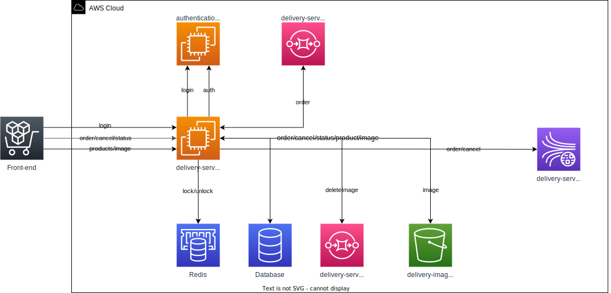

<div align="center">
  <br />
  
  <br />
  <p>
    
    
    <a href="https://github.com/thalesmacena/delivery-service/commits/main">
      
    </a>
<a href="https://github.com/thalesmacena/delivery-service/issues"></a>
  </p>
</div>

## 🗂 Table of Contents
- [🗂 Table of Contents](#-table-of-contents)
- [📑 About](#-about)
- [💻 Technologies](#-technologies)
- [🔥 Running the application](#-running-the-application)
- [🕵 API DOC](#-api-doc)
  
  
## 📑 About
This is a small example of how to create a service Rest API using Springboot. This example will include: API Rest, database, cache, communication with microservices, messaging, stream, security filters, logging, monitoring, containerization and documentation



## 💻 Technologies

<div style="display: grid; grid-template-columns: 1fr 1fr">

<a href="https://en.wikipedia.org/wiki/Java_(programming_language"></a>

<a href="https://maven.apache.org/"></a>

<a href="https://spring.io/projects/spring-boot"></a>

<a href="https://spring.io/"></a>

<a href="https://spring.io/projects/spring-security"></a>

<a href="https://camel.apache.org/"></a>

<a href="https://aws.amazon.com/"></a>

<a href="https://www.docker.com/"></a>

<a href="https://www.postgresql.org/"></a>

<a href="https://redis.io/"></a>

<a href="https://springdoc.org/"></a>

</div>

## 🔥 Running the application

**Prerequisites**
- java jdk 17

- Maven

- Docker

**Run**
```PowerShell
# To copy this repository
git clone https://github.com/thalesmacena/delivery-service.git

# To move to project directory
cd delivery-service
```

## 🕵 API DOC
to access the api documentation just access the following [url](http://localhost:8080/delivery-service/swagger-ui.html) after run the application.
